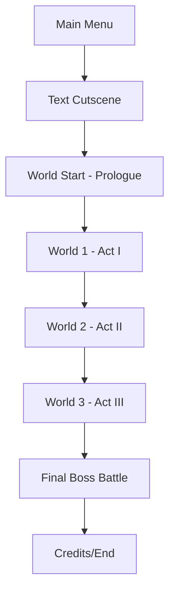
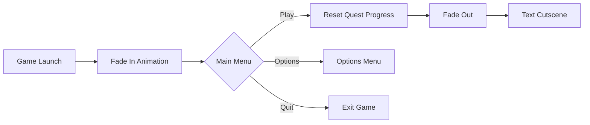
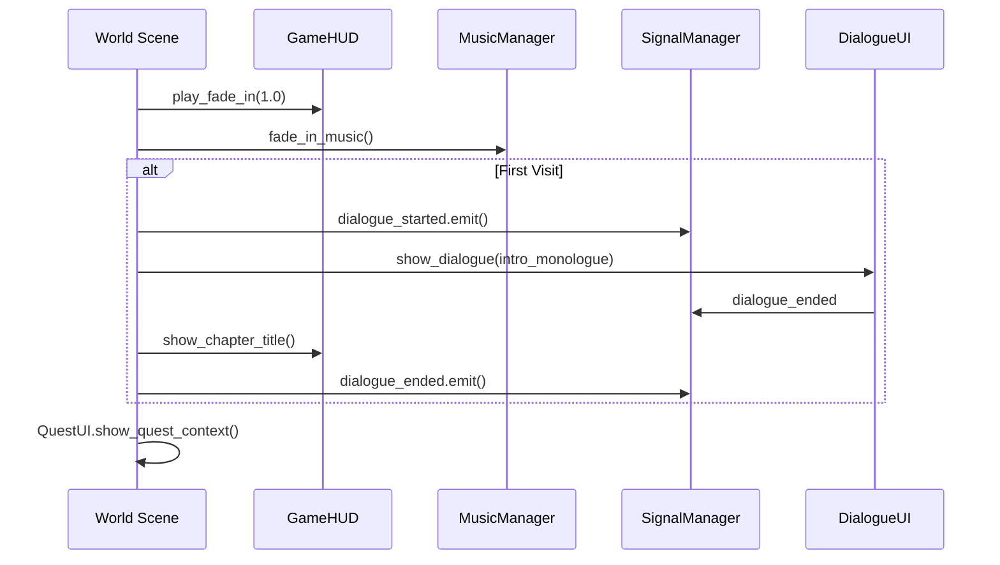
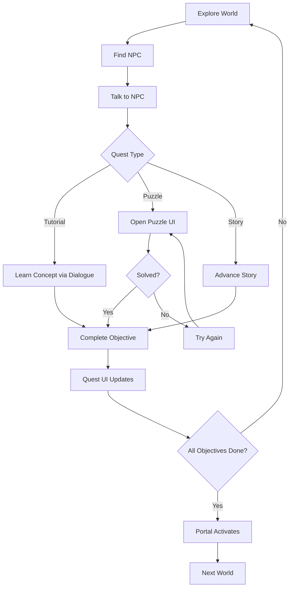
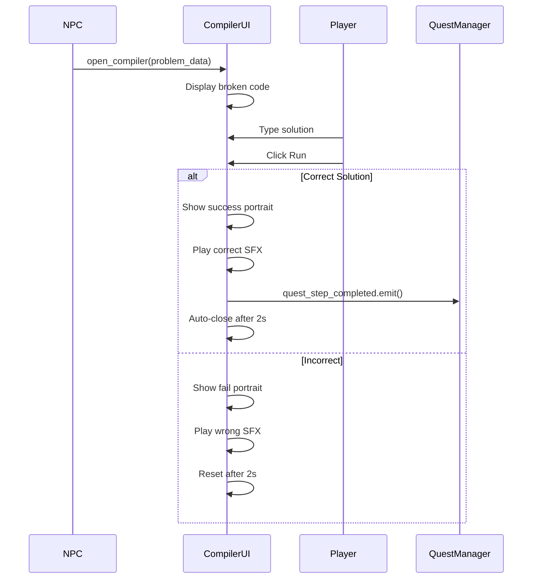
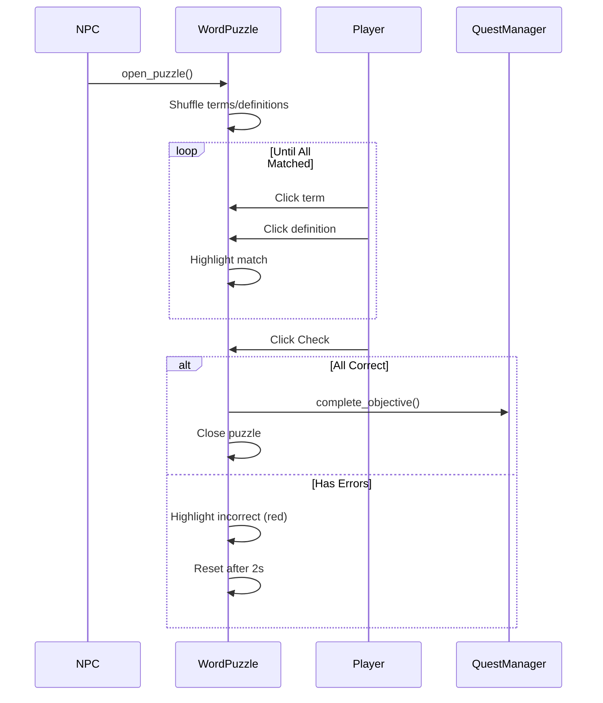
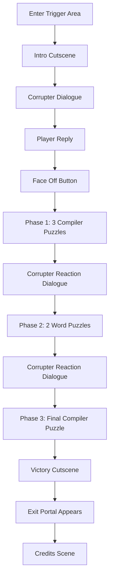

# Game Flow

Documentation of gameplay progression and player journey through Code[X]:Nexus.

---

## High-Level Flow

---

## Main Menu Flow

**Key Actions:**
- `QuestManager.reset_all_quests()` is called on "Play" to ensure fresh start
- Music fades in on menu load, fades out before scene transition

---

## Act Structure

| Act | World Scene | Chapter Title | Theme |
|-----|-------------|---------------|-------|
| **Prologue** | world_start | "Why am I here?" | Awakening, introduction |
| **Act I** | world_1 | "A Glimpse of Light" | Garden/mansion, darkness puzzle |
| **Act II** | world_2 | "The One Behind it All" | Laboratory, tech puzzles |
| **Act III** | world_3 | "The Horizon's End" | Glitched void, final confrontation |
| **Final Act** | world_3 (cont.) | "Corrupter's Desire" | Boss battle |

---

## Per-World Flow

### World Entry Sequence

---

## Player Gameplay Loop

---

## Puzzle Interaction Flow

### CompilerUI (Code Fixing)

### WordPuzzle (Term Matching)

---

## Scene Transition Pattern

All world transitions use a consistent pattern:

1. **Fade Out**: `GameHUD.play_fade_out(1.0)`
2. **Music Fade**: `MusicManager.fade_out_music(1.0)`
3. **Scene Change**: `get_tree().change_scene_to_file()`
4. **Fade In**: New world calls `GameHUD.play_fade_in(1.0)`
5. **Music Start**: `MusicManager.fade_in_music()`

---

## Boss Battle Flow (World 3)

