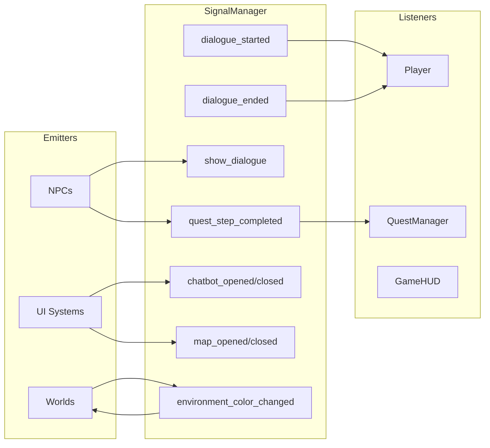
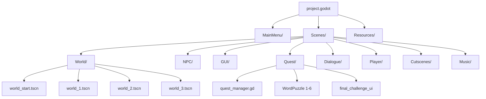
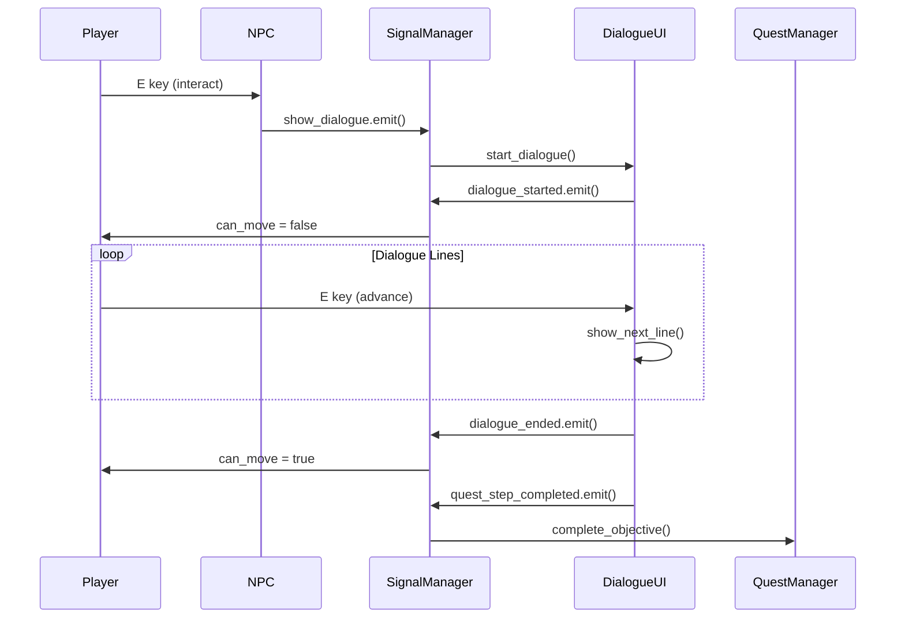

# System Architecture

Technical documentation for Code[X]:Nexus architecture and systems.

---

## Autoload Singletons

The game uses **21 autoloaded singletons** for global state and UI management:

| Autoload | Script/Scene | Purpose |
|----------|--------------|---------|
| `DialogueUI` | dialogue_ui.tscn | Branching dialogue system |
| `SignalManager` | signal_manager.gd | Global event bus |
| `GameHUD` | game_hud.tscn | HUD, chapter titles, fades |
| `ChatbotUI` | chatbot_ui.tscn | AI-powered C++ assistant |
| `CompilerUI` | compiler_ui.tscn | Code-fixing puzzle interface |
| `QuestManager` | quest_manager.gd | Quest/objective tracking |
| `QuestUI` | quest_ui.tscn | Quest display panel |
| `PauseMenu` | pause_menu.tscn | Pause menu |
| `ItemGetPopup` | item_get_popup.tscn | Item acquisition popup |
| `MusicManager` | music_manager.tscn | Audio fade in/out |
| `MapScene` | map_scene.tscn | World map with notes |
| `SceneLoader` | SceneLoader.gd | Scene transitions |
| `PuzzleManager` | puzzle_manager.gd | Puzzle portrait storage |
| `WordPuzzle` 1-6 | WordPuzzle.tscn | Term-matching puzzles |
| `FinalChallengeUI` | final_challenge_ui.tscn | Boss battle initiation |
| `OptionsMenu` | options_menu.tscn | Settings menu |

---

## Signal-Based Event System

`SignalManager` serves as a **central event bus** for loose coupling between systems:

### Key Signals

| Signal | Emitted By | Purpose |
|--------|------------|---------|
| `dialogue_started` | DialogueUI | Freezes player movement |
| `dialogue_ended` | DialogueUI | Unfreezes player |
| `show_dialogue` | NPCs/Worlds | Triggers dialogue display |
| `quest_step_completed` | DialogueUI/Puzzles | Updates quest progress |
| `environment_color_changed` | NPCs | Triggers world lighting changes |

---

## Scene Hierarchy

---

## Data Flow

### Player Interaction Loop

---

## Physics Layers

| Layer | Name | Used By |
|-------|------|---------|
| 1 | Environment | Walls, obstacles |
| 2 | Player | Player character |
| 3 | Puzzle Elements | Interactive objects |
| 4 | Puzzle Walls | Blocking barriers |
| 5 | Enemies | Boss, hazards |

---

## Input Mappings

| Action | Keys | Purpose |
|--------|------|---------|
| `move_right` | D | Movement |
| `move_up` | W | Movement |
| `move_left` | A | Movement |
| `move_down` | S | Movement |
| `interact` | E | NPC/object interaction |
| `toggle_quest_ui` | TAB | Show/hide quest panel |
| `ui_pause` | P, ESC | Pause menu |

---

## Rendering Configuration

- **Viewport**: 960x540 pixels
- **Stretch Mode**: canvas_items
- **Renderer**: GL Compatibility
- **Texture Filter**: Nearest (pixel-perfect)
- **2D Transform Snap**: Enabled
