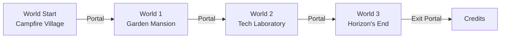

# World Flow

Documentation of world structure, objectives, and progression in Code[X]:Nexus.

---

## World Map Overview

---

## World Start (Prologue)

**Theme**: Corrupted campfire village  
**Chapter**: "Prologue: Why am I here?"  
**Environment**: Dim, mysterious mood

### Objectives

| ID | Objective | NPC/Trigger |
|----|-----------|-------------|
| `intro_monologue_played` | Initial awakening | Auto-trigger |
| `met_aliff` | Meet Aliff | Aliff NPC |
| `met_jackal` | Meet Jackal | Jack NPC |
| `met_adli` | Meet Adli | Adli NPC |
| `met_maya` | Meet Maya | Maya NPC |
| `met_alya` | Meet Alya | Alya NPC |
| `got_nexus` | Receive the Nexus | Maya NPC |
| `map_monologue_played` | View the world map | Map item |

### NPCs Present
- **Aliff** - Story introduction
- **Jack (Jackal)** - Backstory
- **Adli** - Tutorial dialogue with quiz
- **Maya** - Gives the Nexus (chatbot access)
- **Alya** - Quiz dialogue

### Exit Condition
Complete all objectives → Portal to World 1 activates

---

## World 1 (Act I)

**Theme**: Dark garden mansion  
**Chapter**: "Act I: A Glimpse of Light"  
**Environment**: CanvasModulate darkness, light aura on player

### Objectives

| ID | Objective | Type |
|----|-----------|------|
| `world_1_monologue_played` | Intro sequence | Auto |
| `met_zafran` | Talk to Zafran | Story |
| `solved_darkness_puzzle` | Fix the darkness | CompilerUI |
| `met_bukh` | Talk to Bukh | Story |
| `solved_bukh_puzzle` | Complete Bukh's challenge | CompilerUI |
| `met_lyra` | Talk to Lyra | Story |
| `solved_lyra_puzzle` | Complete word matching | WordPuzzle |
| `played_lyra_success_dialogue` | Lyra success dialogue | Auto |
| `met_shafiq` | Talk to Shafiq | Story |
| `solved_shafiq_puzzle` | Complete code puzzle | CompilerUI |
| `played_shafiq_success_dialogue` | Success dialogue | Auto |
| `met_asad` | Talk to Asad | Story |
| `completed_asad_quiz` | Pass Asad's quiz | Dialogue Quiz |

### Environmental Effect
- Solving Zafran's puzzle triggers `environment_color_changed`
- World fades from dark to bright over 10 seconds
- Player's light aura hides

---

## World 2 (Act II)

**Theme**: Tech laboratory  
**Chapter**: "Act II: The One Behind it All"  
**Environment**: Dark lab with animated lights

### Objectives

| ID | Objective | Type |
|----|-----------|------|
| `world_2_monologue_played` | Intro sequence | Auto |
| `met_niko` | Talk to Niko | Story |
| `solved_niko_puzzle` | Fix function code | CompilerUI |
| `met_aliffr` | Talk to Aliff R | Story |
| `solved_aliffr_puzzle` | Complete puzzle | CompilerUI |
| `met_adriana` | Talk to Adriana | Story |
| `solved_adriana_puzzle` | Complete puzzle | CompilerUI |
| `played_adriana_success_dialogue` | Success dialogue | Auto |
| `met_zul` | Talk to Zul | Story |
| `solved_zul_puzzle` | Complete puzzle | CompilerUI |
| `played_zul_success_dialogue` | Success dialogue | Auto |
| `met_aqil` | Talk to Aqil | Story |
| `solved_aqil_puzzle` | Complete puzzle | CompilerUI |
| `played_aqil_success_dialogue` | Success dialogue | Auto |

### Environmental Effect
- Solving `niko_function_puzzle` → Left light turns green
- Solving `aliffr_puzzle` → Right light turns green
- Door unlock SFX plays

---

## World 3 (Act III + Final Act)

**Theme**: Glitched void at the edge of existence  
**Chapter**: "Act III: The Horizon's End" → "Final Act: Corrupter's Desire"  
**Environment**: Pulsing red glitch effect, screen shader bursts

### Objectives

| ID | Objective | Type |
|----|-----------|------|
| `world_3_monologue_played` | Intro sequence | Auto |
| `met_erin` | Talk to Erin | Story |
| `learned_conditionals` | Learn conditionals | Dialogue |
| `met_akari` | Talk to Akari | Story |
| `learned_loops` | Learn loops | Dialogue |
| `met_isyraq` | Talk to Isyraq | Story |
| `learned_variables` | Learn variables | Dialogue |
| `met_rapxstor` | Talk to Rapxstor | Story |
| `learned_functions` | Learn functions | Dialogue |
| `face_corrupter` | Trigger boss cutscene | Trigger Area |
| `solved_phase1` | Complete Phase 1 | Boss Battle |
| `solved_phase2` | Complete Phase 2 | Boss Battle |
| `solved_phase3` | Complete Phase 3 | Boss Battle |
| `solved_word1` | Word Puzzle 5 | Boss Battle |
| `solved_word2` | Word Puzzle 6 | Boss Battle |
| `solved_final_phase` | Final puzzle | Boss Battle |
| `defeated_corrupter` | Defeat The Corrupter | Boss Battle |

### Barrier Mechanic
- 4 Guardian NPCs (Erin, Akari, Isyraq, Rapxstor) block path
- Learning all concepts → Barrier fades + NPCs disappear
- Camera pans to reveal Corrupter area

### Environmental Effects
- **Slow Red Pulse**: CanvasModulate alternates between normal and corrupted color
- **Screen Shader Bursts**: Random glitch static effects
- Intensity increases atmosphere of final confrontation

---

## Portal System

Each world contains portals that:
1. Check if world objectives are complete
2. Play fade-out animation
3. Fade music
4. Load next scene
5. Play fade-in on new world

### Portal Scripts
- `portal.gd` → world_start to world_1
- `portal_2.gd` → world_1 to world_2
- `portal_3.gd` → world_2 to world_3
